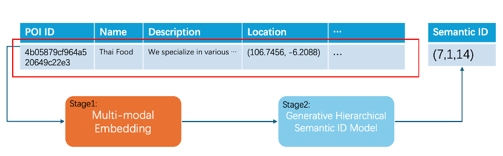
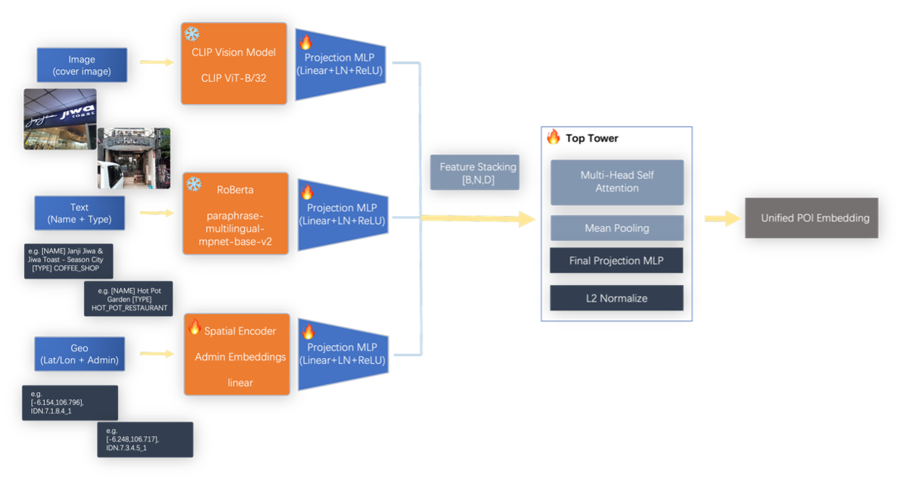
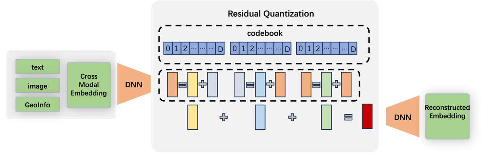
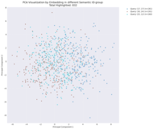
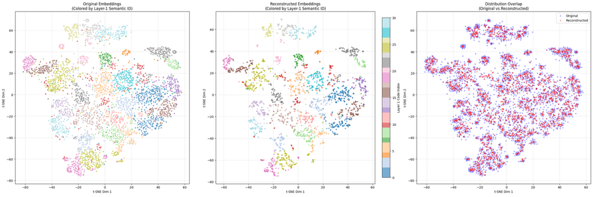
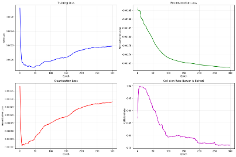
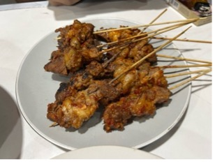
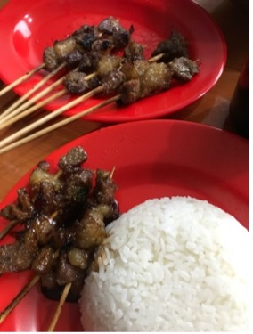
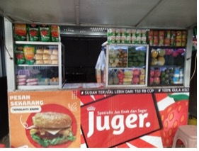
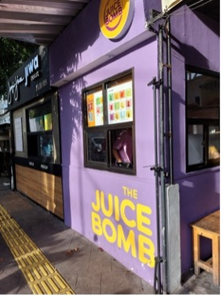

# POI Geographic Semantic ID (POI-GSID)

This repository contains the official codebase for generating Geographic Semantic IDs (GSID) for Points of Interest (POIs) using a multi-modal representation architecture combined with Residual Quantization (RQ-VAE). Our pipeline transforms heterogenous raw POI data—textual, visual, and geographic—into compact, structured representations that preserve both semantic meaning and spatial hierarchy.

This codebase serves as the technical implementation behind the course report mapping multimodal POI representation into a quantized latent space.

---

## 1. Project Architecture

The overall methodology is decoupled into two primary stages: 

1.  **Multi-Modal POI Encoding (Embedding)**
2.  **Semantic ID Generation via RQ-VAE**

### 1.1 Data Preprocessing & Pipeline


The initial pipeline cleanses missing fields and formats inputs for optimal modeling:
- **Text:** Cleansed categories, names, and descriptions.
- **Visuals:** POI cover images downloaded and uniformly processed.
- **Geospatial:** Coordinates (Latitude/Longitude) mapped alongside hierarchy codes (e.g., Province, City, District).
*(For missing pattern distributions, see `docs/nullrate.png` and `docs/data_illustrate.png`)*

### 1.2 Multi-Modal Fusion Architecture


We fuse three distinct modalities into a continuous representation:
- **Image:** Encoded via a pre-trained Vision Transformer (CLIP).
- **Text:** Encoded via a multilingual Text-Encoder (MPNet).
- **Geo:** A custom Sine/Cosine positional encoder for exact coordinates concatenated with learned embeddings for categorical administrative distributions.
- **Fusion Layer:** Fused dynamically via Multi-Head Attention, utilizing a Contrastive Loss variant over a batch to enforce similarity across augmented/similar POIs.

### 1.3 Residual Quantization (RQ-VAE)


Following the production of high-dimension continuous embeddings, we train a Residual Quantization Variational Autoencoder (RQ-VAE) to discretize vectors into hierarchical, multi-level semantic IDs.
- **Residual Codebooks:** Employs multiple stages of codebooks ($K_1, K_2, K_3$).
- **Loss Functions:** Reconstructive Loss + Commitment/Quantization Loss + optional Diversity constraints.
- **Output:** A tuple denoting a hierarchical grouping, e.g., `(26, 22, 10)`, identifying its spatial-semantic cluster safely.

---

## 2. Experimental Results

Our framework was evaluated based on the separability of the continuous vector space and the stability/reconstructive quality of the quantized ids. 

### Latent Space Separability
We visualized the output continuous embeddings utilizing PCA and t-SNE, demonstrating natural clustering driven by underlying POI categorization and geographic locale.

**PCA & t-SNE Clustering:**
| PCA Visualization | t-SNE Embeddings |
|:---:|:---:|
|  |  |

### RQ-VAE Training Performance
The quantization step preserves representations while collapsing them into stable sub-groups.
- **Reconstruction VAE Loss:** Minimized smoothly across epochs.  
  

**Bucket Visualizations (Representative Decoded Outputs):**
Example representative clustering captures semantically alike POIs successfully regardless of physical proximity.

| Bucket 1 | Bucket 2 | Bucket 3 |
|:---:|:---:|:---:|
|  |  |  |
|  |  |  |
|  |  |  |

---

## 3. Usage & Execution

The environment manages dependencies via standard package managers (`pip` or `uv`). A PyTorch compatible environment is required.

### 3.1 Training the Multi-Modal Encoder
Train the POI embedding encoder. It supports mixed batch streams (Parquet or CSV) alongside local/remote image caches.

```bash
python embedding_training.py \
    --csv_path dataset/id_pois/sample500_preprocessed.csv \
    --image_dir /path/to/poi_images \
    --output_dir ./poi_encoder_output \
    --num_epochs 10 \
    --batch_size 64
```

### 3.2 Generating Continuous Embeddings
Generate the initial high-dimensional representations for all processed candidates using your saved checkpoint.

```bash
python embedding/inference.py \
    --model_path poi_encoder_output/final_model \
    --csv_path dataset/id_pois/sample500_preprocessed.csv \
    --image_dir /path/to/poi_images \
    --output_path artifacts/poi_embeddings.pkl \
    --batch_size 128
```

### 3.3 Training the RQ-VAE
Feed the generated continuous embeddings directly into the RQ-VAE routine to build hierarchical quantization codebooks.

```bash
python rqvae_training.py \
    --embedding_pkl_path artifacts/poi_embeddings.pkl \
    --ckpt_dir artifacts/rqvae_checkpoints \
    --epochs 300 \
    --batch_size 256 \
    --lr 1e-4
```

### 3.4 Extracting Final Semantic IDs (Inference)
Run the RQ-VAE inference pass to generate the resulting Semantic ID mappings format `{POI_ID: (Level1, Level2, Level3)}`.

```bash
python rqvae/inference.py \
    --embedding_pkl_path artifacts/poi_embeddings.pkl \
    --ckpt_dir artifacts/rqvae_checkpoints \
    --save_path final_poi_semantic_ids.pkl \
    --batch_size 256
``` 
